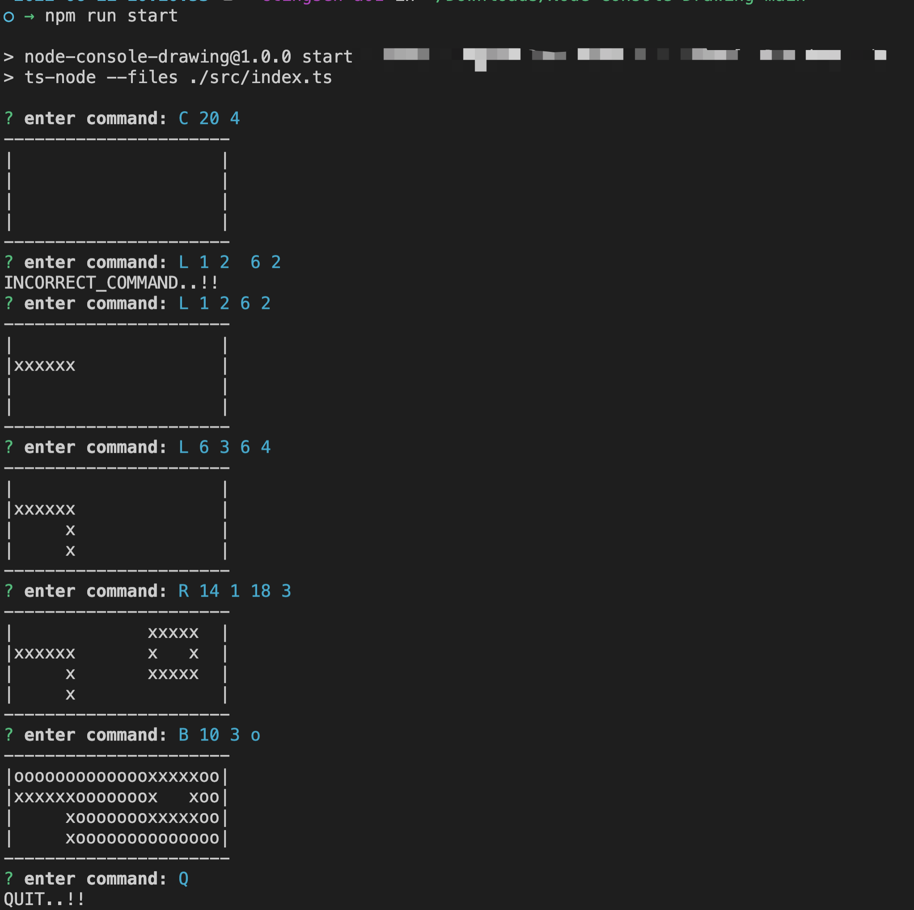

# Terminal Drawing Program by NodeJs

## Description

A simple **console** version of a drawing program.

[Support functionality]

1. Create a new canvas
2. Start drawing on the canvas by issuing various commands
3. Quit

## Prerequisites

[Node.js](https://nodejs.org/en/) >= version 11.0.0

To check if **node** is installed, try a command below

```sh
node -v
-> v11.0.0
```

## How to run

Open the terminal

```sh
npm install
```

After the above command, execute a commmand like below

### Run the program

```sh
npm start
```



### Run the test cases

```sh
npm run test
```

### Run the test cases and get coverage report

```sh
npm run test:coverage
```


### Build for production

```sh
npm run build
```

## Used Libraries

* [Inquirer.js](https://github.com/SBoudrias/Inquirer.js) - command line interface for **Node.js**
* [Jest](https://facebook.github.io/jest/) - **Javascript** Test Framework
* [Eslint](https://eslint.org/) - Linting utility for **JavaScript**
* [Typescript](https://www.typescriptlang.org/) - TypeScript is JavaScript with syntax for types.

## Folder Structure

``` sh
.
├── canvas
│   ├── fill.ts // Fill coordinates of Canvas
│   ├── fill.test.ts
│   ├── index.ts // Create Canvas, Update coordinate in Canvas and Render Canvas
│   ├── index.test.ts
│   ├── newLine.ts // Get coordinates of new Line
│   ├── newLine.test.ts
│   ├── newRectangle.ts // Get coordinates of new Rectangle
│   ├── newRectangle.test.ts
│
├── config.ts
├── handleCommand.ts // Handle commands from terminal, to create canvas, create line, create rectangle and fill.
├── handleCommand.test.ts
├── index.ts // Statring point of the App and call validate and handleCommand
├── validate.ts // Validate commands from terminal
└── validate.test.ts
```

## Assumptions

1. The command should be exactly matched to be executed.
> e.g. Invalid commands, * means a space
* c\*5\*5 -> no capital letter
* C\*5\*5\* -> ending space
* C\*5\*\*5 -> additional space

2. For color of Fill command, it only allows English alphabet, both small letter and capital letter.

3. It doesn't allow to draw line or reactangle and fill wihtout Canvas.

4. It can draw line or reactangle again in coordinates that are filled with color.

## Explanation of main logics


### Canvas Data

* Canvas is consisted of two dimensional array. The parent array means Y axis value and the child array means X axis. Child array is made up of an object that has a key, draw and fill.

* The key, draw is used to render a line, a rectangle or filled color.

```javascript
const canvasData = [
  [{
    draw: draw-value,
  }]
];
```

### Draw line, rectangle and fill

* When it receives coordinates for `line`, `rectangle` or `fill`, it will calculate required coordinates and return an array that has x, y coordinate array. Next, it will update canvas data with the returned array by matching the coordinates.

#### Fill color

* Check the current coordinate whether can fill or not.
* If can fill, fill it, and then Recursively process coordinate up, down, left and right.

#### How to get the coordinate can be filled or not?
It's initial value and has not filled.

## In the future
* Reuse existing print results
* Prevent canvasdata from being arbitrarily modified
